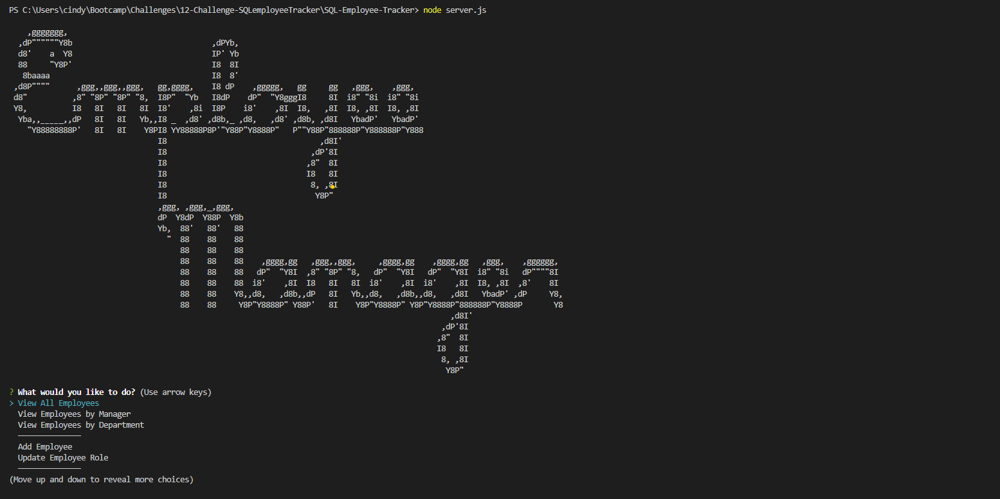
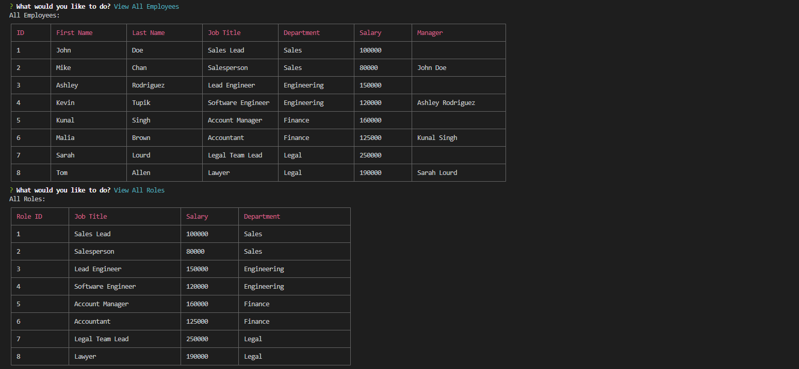
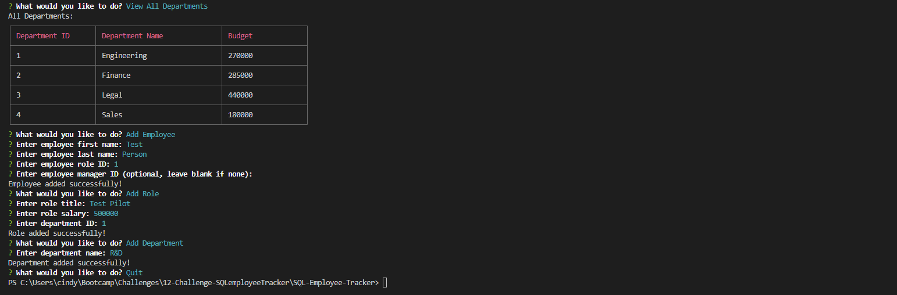

# SQL-Employee-Tracker

### **[Description](#description) | [Installation](#installation) | [Usage](#usage) | [Credits](#credits) | [License](#license) | [Contribute](#contribute) | [Questions](#questions)**

## Description

This here application is a content management system (CMS) that utlizes a command-line application to manage a company's employee database, using Node.js, Inquirer, and MySQL.

I learned a great deal on how to utilize MySQL and how to make it interface in a responsive manner with Inquirer. I got to utilize CRUD properties, and dive further into node, tables, schemas, seeds, and more.

## Installation

Starting Inquirer:
1. Fork or download repository
2. Open the terminal in the root folder
3. In the terminal, enter `npm i`
4. Enter `mysql -u root -p`
5. Sign in with your mySQL password
6. Enter `SOURCE db\schema.sql` then `exit`
7. Run `node server.js`

## Usage

This project will not be deployed. Refer to the following images and associated [tutorial video file](./Assets/screen-capture-sqlCompanyDB.mp4) or [tutorial video link](https://drive.google.com/file/d/1ShN7gi9BeF5is98RySWEZBzfXbvlQoJL/view?usp=sharing). 

Run through the Inquirer prompts and complete entries if applicable.

The images below display an sample of the app, see the tutorial video for a more thorough display:  

## Credits

- Collaborators: 
  - N/A.
- Third-party assets: 
  - https://www.askapache.com/online-tools/figlet-ascii/
  - https://www.npmjs.com/package/cli-table3
  - https://www.npmjs.com/package/express
  - https://www.npmjs.com/package/inquirer
  - https://www.npmjs.com/package/mysql2
- Tutorials: 
  - UCSD-VIRT-FSF-PT-03-2023-U-LOLC
  - https://www.geeksforgeeks.org/how-to-create-a-table-with-multiple-foreign-keys-in-sql/#

## License

 The license this application is covered under is: [MIT License](https://mit-license.org/).

## Contribute

In general, follow the "fork-and-pull" Git workflow.

  1. **Fork** the repo on GitHub.
  2. **Clone** the project to your own machine.
  3. **Commit** changes to your own branch.
  4. **Push** your work back up to your fork.
  5. Submit a **pull request** so that your changes can be reviewed.
    
  NOTE: Be sure to merge the latest from "upstream" before making a pull request!
  
  When contributing to this project, please follow the [Contributor Covenant](https://www.contributor-covenant.org/version/2/1/code_of_conduct/) code of conduct.

## Questions

My gitHub username is [itsa-me-dea](https://github.com/itsa-me-dea), and you can contact me at wachadea@gmail.com.
